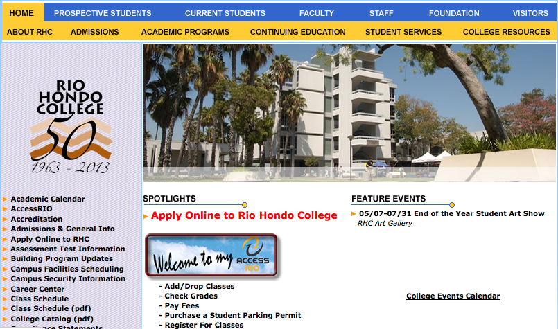
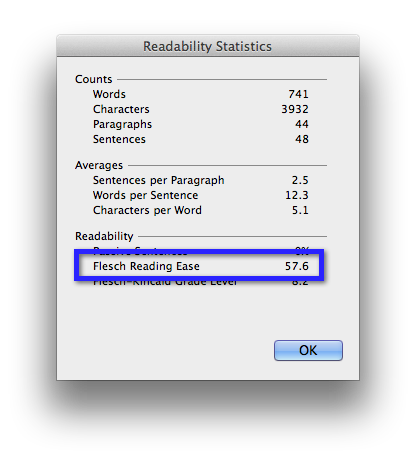
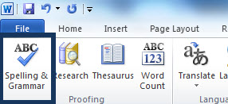

% Content Creation Guidelines
% Sable Cantus & Zulma Calderon
% 2013 Rio Hondo Website Refresh

# Creating Content for the Web

Thank you for being here today!

Your work is **very important!**

You are the experts in your area. You know what is going on. You know what your audience is looking for when they visit your website.

This presentation is available at [riohondo.edu/its/content_creation](http://www.riohondo.edu/its/content_creation)

# What to Expect Today

We are going to talk about creating good content for your campus website. Writing good content is not the same as good design or good formatting.

Today we will:

- Talk about good content
- Talk about identifying our target audience
- Make an outline of new site
- Look at our existing content
- Take some time to work

# Current State of Affairs

Navigate to your area of the website.

# A Plain Text Editor

- Notepad
- TextEdit
- [Draftin.com](http://draftin.com)

**Turn on Word Wrap**

*Why use something so simple when we have word?*

# Focus

# Start With An Outline

> Let's use the IT website as a simple example. This site completely focuses on content.

**ITS Homepage**

* Welcome and About ITS statement

**Help Desk**

* Contact information at the top and how to access the help desk system

**Audio / Visual**

* Contact Info

**Training**

* Contact Info
* Headers for specific information (for scanning) and short descriptive paragraphs

# ITS Screenshot

[ITS Website](http://www.riohondo.edu/its)

# Who Are You Writing For?

> The IT website is focused on college faculty and staff. 

**Who is your audience?**

- students
- faculty
- staff
- the general public
- adult learners
- ???

# Respect Your Audience

The campus website should be your communication tool. People will come to your site looking for *something*. Make that *something* front and center.

**Why do people visit your website?**

* Location
* Office Hours
* Forms
* Download Documents
* ???

# Does Your Website Look Like Lings?

[Ling missed his training day](http://www.riohondo.edu/its/content_creation)

# Some Tips to Work With

* Write like a journalist by putting the important information up front with links to further details
* Write concisely and in plain english
* Start from scratch and use only what you need
* Review, review, review
* Only underline hyperlinks and use **bold** or *italics* sparingly instead for emphasis

# Help Readers Scan

> *from [Usability.gov](http://www.usability.gov/methods/design_site/writing4web.html)*

* Use headings and sub-headings
* Write short sentences
* Limit paragraphs to two-three sentences
* Use bulleted or numbered lists
* Plan to use pictures, images, diagrams, or illustrations to visually represent ideas in the content
* Add a table of contents at the top of the page and hyperlink the categories to the related content on the page
* Use white space to visually separate information

# Structure Your Text

Make use of **bold headings**, short paragraphs, bullet lists and tables if the information requires it. 

To better organize your thoughts, divide your article into sub-headings. Sub-headings make things easier to digest. 

Instead of tackling the entire article at once, try writing one paragraph at a time.

# Test Your Content's Readability

After you have been writing your content in notepad. You may paste it into Microsoft Word and use the Readability Statistics feature.

This is not required, but may be used to help you analyze your content.

# Enable Readability Statistics in Word

File &raquo; Options &raquo; Proofing &raquo; Enable Readability Statistics

# Use the Spelling & Grammar Tool

Review &raquo; Spelling & Grammar

# Review, Review, Review, Refresh

Review your content before you publish.

Get someone else to read your content and check if it "makes sense" to them.

Make yourself a reminder to go through your site and make sure the content is current.

# Some Tips to Collaborate

You can work with your team using online tools to collaborate efficiently without emailing text files back and forth using tools such as:

* [Google Docs](http://drive.google.com/)
* [Draftin.com](http://draftin.com/)
* [Fargo (for outlining)](http://fargo.io/)
* [Firepad.io](http://www.firepad.io/)

# Questions?

# Thank You

# Resources

- [Workshop Handouts (pdf download)](assets/handouts.pdf)
- [Usability.gov](http://www.usability.gov/methods/design_site/writing4web.html)
- [Writing in a Readable Style](http://www.4syllables.com.au/resources/web-writing-tips/readable-writing/) (*your handout*)
- [How to Write Great Website Content](http://blogcritics.org/how-to-write-great-website-content/)
- [Test Your Documents Readability in Word](http://office.microsoft.com/en-us/word-help/test-your-document-s-readability-HP010148506.aspx#BM1)
- [The Oatmeal: When to Use an Apostrophe](http://theoatmeal.com/comics/apostrophe)

<meta name="duration" content="45" />